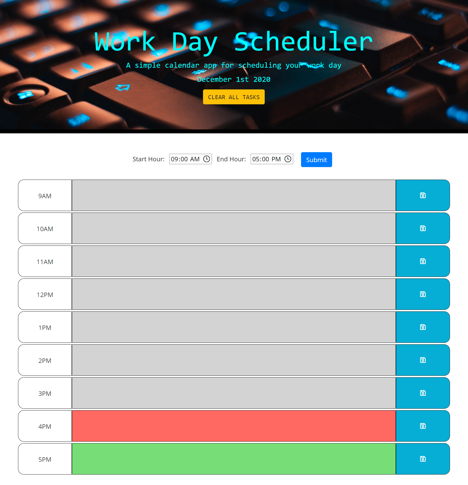
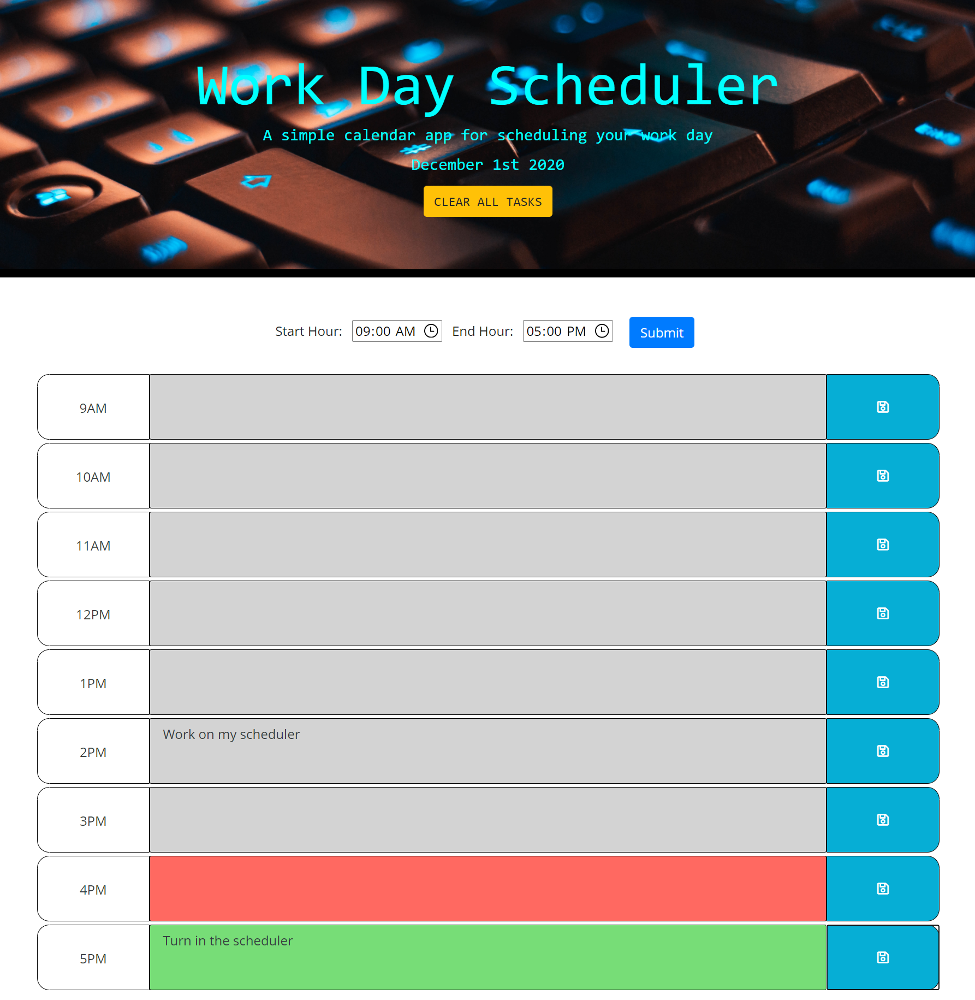

# Work Day Scheduler Starter Code

A simple calendar app for scheduling your work day.

## Description

* You can set your start and end time for your day.
* You will be able to save and updated a task for each hour.
* Clear all your tasks.
* Time blocks are color cordinated to show if time is past, present or future.

## Criteria

GIVEN I am using a daily planner to create a schedule 
WHEN I open the planner 
THEN the current day is displayed at the top of the calendar 
WHEN I scroll down 
THEN I am presented with time blocks for standard business hours 
WHEN I view the time blocks for that day 
THEN each time block is color-coded to indicate whether it is in the past, present, or future 
WHEN I click into a time block 
THEN I can enter an event 
WHEN I click the save button for that time block 
THEN the text for that event is saved in local storage 
WHEN I refresh the page 
THEN the saved events persist 

## Screenshots

## Badges

  

## Deployment

[Work Day Scheduler](https://matthewdamron.github.io/work-day-scheduler/)